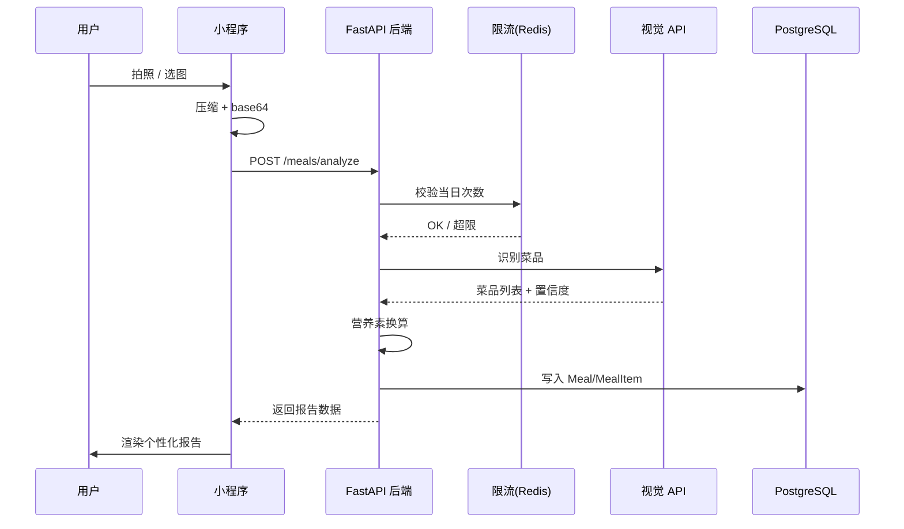
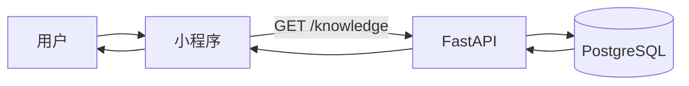

# 关键数据流

## 拍照识膳食



## 知识库检索



## 毒蘑菇 GIS

```mermaid
flowchart LR
    U[用户] --> MP[小程序地图]
    MP -->|GET /gis/mushroom-risk| API
    API --> DB[(PostgreSQL)]
    DB --> API
    API --> MP
    MP -->|点击 marker| MP
    MP -->|GET /gis/mushroom-risk/{id}| API
    API --> MP
```